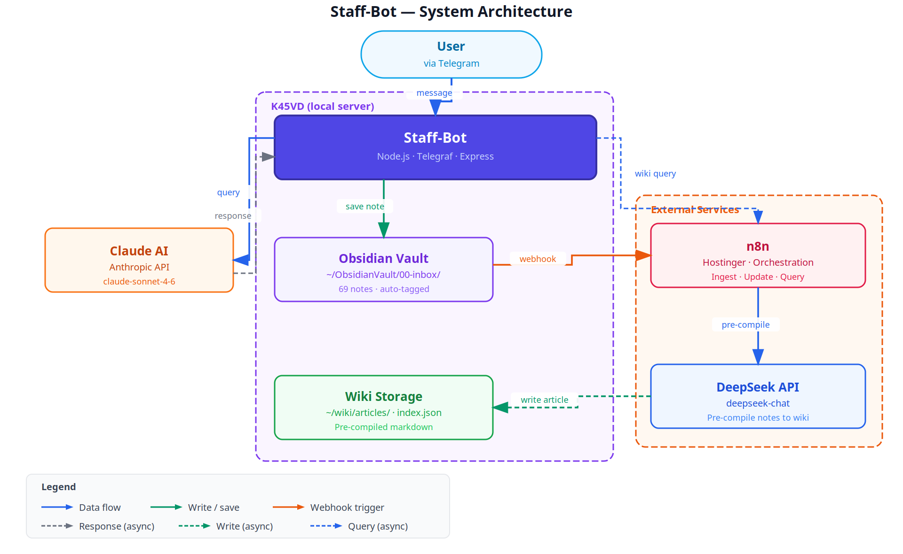

# Staff-Bot

[](LICENSE)
[](https://nodejs.org)
[](https://telegram.org)
[](https://anthropic.com)
[](https://n8n.io)
[](https://deepseek.com)
[](https://obsidian.md)

Personal AI staff assistant — Telegram interface to Claude AI, with automatic note-saving to an Obsidian vault and a pre-compiled LLM wiki powered by DeepSeek and n8n.

## Architecture



**K45VD (local server)** runs Staff-Bot alongside an Obsidian vault and wiki storage. **Claude AI** handles conversational reasoning. **n8n** on Hostinger orchestrates wiki ingestion and updates. **DeepSeek** pre-compiles vault notes into structured wiki articles for fast, embedding-free retrieval.

## Features

- **Conversational AI** — multi-turn chat via Claude Sonnet 4.6 with session continuity per user
- **Obsidian inbox** — forward URLs or text from Telegram; auto-saves to `00-inbox/` with YAML frontmatter and auto-tags (bazi, qimen, ai-tools, rag, macro-finance, etc.)
- **URL extraction** — paste a link and the bot fetches, strips, and saves the page content
- **LLM Wiki** — Karpathy-style pre-compiled wiki: each saved note becomes a structured article; query via natural language, no vector DB needed
- **Webhook integration** — new notes trigger n8n automatically to compile and index the wiki article
- **Authorization** — whitelist-based user access control
- **Session management** — per-user Claude CLI sessions with configurable timeouts

## Tech Stack

| Component | Technology |
|-----------|-----------|
| Bot runtime | Node.js ≥ 20, Telegraf |
| AI reasoning | Claude Sonnet 4.6 (Anthropic API) |
| Note storage | Obsidian vault (markdown + frontmatter) |
| Wiki engine | n8n + DeepSeek (pre-compile, no embeddings) |
| Orchestration | n8n on Hostinger |
| Sync | Syncthing (K45VD ↔ Windows) |

## Setup

### Prerequisites

- Node.js ≥ 20
- A Telegram bot token ([BotFather](https://t.me/BotFather))
- Anthropic API key
- DeepSeek API key (for LLM wiki)
- n8n instance (self-hosted or Hostinger)

### Install

```bash
git clone https://github.com/lerlerchan/staff-bot.git
cd staff-bot
npm install
cp .env.example .env   # fill in your keys
```

### Environment Variables

```env
TELEGRAM_BOT_TOKEN=
ANTHROPIC_API_KEY=
AUTHORIZED_USER_IDS=123456789
TELEGRAM_GROUP_CHAT_ID=
OBSIDIAN_VAULT_PATH=~/ObsidianVault
WIKI_UPDATE_WEBHOOK=https://your-n8n/webhook/wiki-update
```

### LLM Wiki (n8n)

Import the three workflows from `~/ObsidianVault/outputs/`:

| Workflow | Purpose | Activate? |
|----------|---------|-----------|
| `llm-wiki-01-ingest.json` | Full vault compile (manual trigger) | No |
| `llm-wiki-02-update.json` | Single note update (webhook) | **Yes** |
| `llm-wiki-03-query.json` | Query interface (webhook) | **Yes** |

Create two n8n credentials:
- **SSH (Private Key)** named `K45VD SSH` — host: your server IP
- **Header Auth** named `DeepSeek API` — `Authorization: Bearer sk-xxx`

Run the full ingest once:

```bash
# In n8n: open workflow 01 → "Test workflow"
# Or query directly after:
curl -X POST https://your-n8n/webhook/wiki-query \
  -H "Content-Type: application/json" \
  -d '{"query": "What is speculative decoding?"}'
```

### Run

```bash
npm start
# or with PM2:
pm2 start start.sh --name staff-bot
```

## Usage

| Telegram command | What it does |
|-----------------|-------------|
| Send any message | Chat with Claude AI |
| Send a URL | Fetch, summarize, and save to Obsidian inbox |
| `/save <title>` | Save current message as a named note |
| `/notes` | List last 5 inbox notes |
| `/wiki <query>` | Query the pre-compiled LLM wiki |
| `/clear` | Reset Claude session |

## License

[GNU AGPL-3.0](LICENSE) © 2026 lerlerchan

Network copyleft: if you host this as a service, you must publish your modifications under the same license. See [LICENSE](LICENSE) for the additional permission clause covering Telegram Bot API, Claude API, and DeepSeek API integration.
